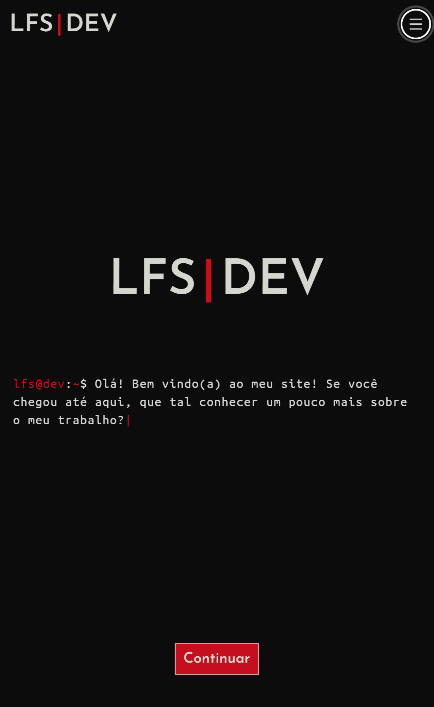

<h1 align="center">
   Portfólio - LFS|DEV
</h1>

##  📚 Resumo do Projeto
É este meu site! Ele foi feito utilizando o conceito Mobile First, que foca na experiência dos usuários de smartphones. Ele é totalmente feito em HTML, CSS e JavaScript, com algumas centenas de linhas de código.

---

<h4 align="center"><a href="https://lfsdev.com">Clique para visitar o site</a></h4>

## ✔️ Tecnologias e Ferramentas utilizadas

- **HTML**
- **CSS**
- **JavaScript**
---
## 💼 Autor

<table>
  <tr>
    <td align="center">
      <a href="https://github.com/lfs-dev">
         
        
          <b>LFS | DEV</b>
        
      </a>
    </td>
  </tr>
</table>

[LinkedIn](https://www.linkedin.com/in/lfsdev/) | [Telegram](https://t.me/lucaslfsdev) | [Discord](https://discord.gg/qz28z7zrY2)